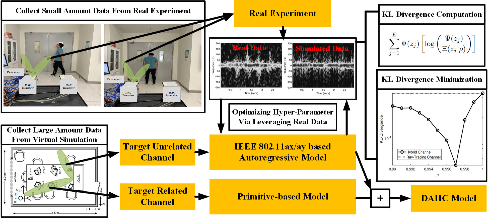
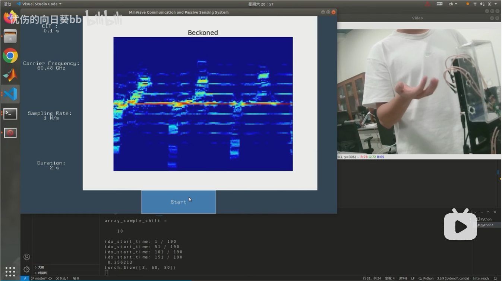

# testSpectrogram

**See THREE video demos at <https://lasso-sustech.github.io/CASTER> or <http://lasso.eee.sustech.edu.cn/caster/> for a quick understanding of our efforts!**

<table>
<thead>
  <tr>
    <th><a href="https://ieeexplore.ieee.org/abstract/document/10233699">SDP3 IOTJ)</a></th>
    <th><a href="https://ieeexplore.ieee.org/abstract/document/9593198">PBAH (SPAWC)</a></th>
    <th><a href="https://doi.org/10.1109/ojcoms.2024.3398016">CASTER (OJ-COMS, early access)</a></th>
    <!-- <th><a href="https://www.bilibili.com/video/BV14G411y7nn/?spm_id_from=333.999.0.0&vd_source=acf5c2e5837a698024101aaf6bf0d161">Video demo on bilibili (chinese)</a></th> -->
  </tr>
</thead>
<tbody>
  <tr>
    <td colspan="2"></td>
    <td></td>
    <!-- <td><a href="https://www.bilibili.com/video/BV14G411y7nn/?spm_id_from=333.999.0.0&vd_source=acf5c2e5837a698024101aaf6bf0d161"></a></td> -->
  </tr>
</tbody>
</table>

## Introduction

[testSpectrogram](https://github.com/rzy0901/testSpectrogram) is an open-source platform for wireless channel simulation, human/hand pose extraction, gesture spectrogram generation, and real-time gesture recognition based on millimeter-wave passive sensing and communication systems.

<!-- Detailed documentation, source codes, and paper information will be coming soon (maybe after paper acceptance). -->
Since this work is experiment-oriented, code might not be 100% consistent with our real implementation. But the gerneral core idea is the same. And we will keep making improvements and updating the code for clearer understanding. 

## Code Overview

### Clone the Repository

```bash
git clone https://github.com/rzy0901/testSpectrogram.git --recursive
```
Alternatively, you can visit the repositories listed in [.gitmodules](.gitmodules) and download each one individually as a zip file.

### Code for "SDP3" and "PBAH" papers

+ [Micro_Doppler_Radar_Simulator](./Micro_Doppler_Radar_Simulator)
  + Data driven hybrid channel model simulation using a Boulic Human walking model.
+ [testZED](https://github.com/rzy0901/testZED) and [zed_pose](./zed_pose)
  + Simple Mocap-based channel simulation example.
  + Camera coordinate 3D human keypoints extraction based on the depth camera ZED 2i, using [zed-sdk](https://github.com/stereolabs/zed-sdk).

### Code for "CASTER" paper

+ [mediapipe_spectrogram](https://github.com/rzy0901/mediapipe_spectrogram)
  + Primitive-based wireless channel simulation for hand gesture recognition.
  + Camera coordinate 3D hand keypoints extraction based on a monocular camera, using [mediapipe](https://github.com/google/mediapipe) and [opencv](https://github.com/opencv/opencv).
+ [CASTER_classification](https://github.com/rzy0901/CASTER_classification) and [RxRealTime_GUI_rzy](https://github.com/rzy0901/RxRealTime_GUI_rzy/tree/master)
  + "Simulation-to-reality" hand gesture recognition based on ResNet18.
  + Transfer learning based on the simulated dataset and real-world dataset.
  + Real-time gesture recognition based on millimeter-wave passive sensing and communication systems, using a model trained by a simulated dataset.

## Cite this repository

```
@inproceedings{li2021wireless,
  title={Wireless sensing with deep spectrogram network and primitive based autoregressive hybrid channel model},
  author={Li, Guoliang and Wang, Shuai and Li, Jie and Wang, Rui and Peng, Xiaohui and Han, Tony Xiao},
  booktitle={2021 IEEE 22nd International Workshop on Signal Processing Advances in Wireless Communications (SPAWC)},
  pages={481--485},
  year={2021},
  organization={IEEE}
}
```

```
@article{li2023integrated,
  title={Integrated Sensing and Communication from Learning Perspective: An SDP3 Approach},
  author={Li, Guoliang and Wang, Shuai and Li, Jie and Wang, Rui and Liu, Fan and Peng, Xiaohui and Han, Tony Xiao and Xu, Chengzhong},
  journal={IEEE Internet of Things Journal},
  year={2023},
  publisher={IEEE}
}
```

```
//Early access article
@ARTICLE{ren2024caster,
  author={Ren, Zhenyu and Li, Guoliang and Ji, Chenqing and Yu, Chao and Wang, Shuai and Wang, Rui},
  journal={IEEE Open Journal of the Communications Society}, 
  title={CASTER: A Computer-Vision-Assisted Wireless Channel Simulator for Gesture Recognition}, 
  year={2024},
  volume={},
  number={},
  pages={1-1},
  keywords={Videos;Wireless communication;Wireless sensor networks;Gesture recognition;Channel impulse response;Transmitters;Training;Wireless hand gesture recognition;channel model;simulation-to-reality inference},
  doi={10.1109/OJCOMS.2024.3398016}}
```

## Authors

[Zhenyu Ren](https://github.com/rzy0901)

[Guoliang Li](https://github.com/GuoliangLI1998)

[Shuai Wang](https://github.com/bearswang)

[Chenqing Ji](https://github.com/Jcq242818)

[Chao Yu](https://github.com/Ychao12032212)

## Acknowledgement

This series of work is under supervision of Prof. Rui Wang and Prof. Shuai Wang.
